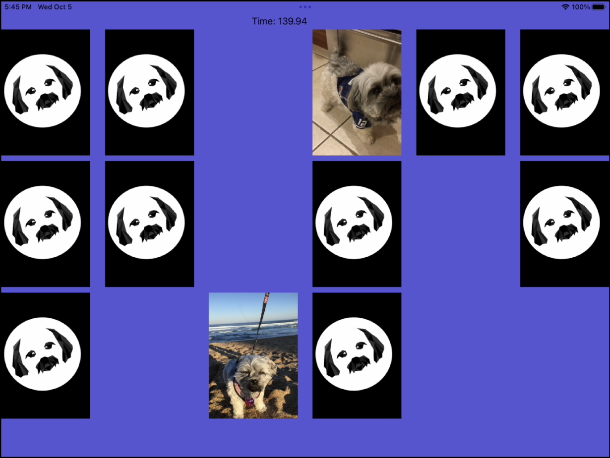

# Matching Coco
This is my very first Swift project. It is an iOS matching game I made in 8th grade following [this tutorial](https://youtube.com/playlist?list=PLMRqhzcHGw1YdahNsCLZdSVfNv0stwvdx) on YouTube. I used pictures of my cousin's dog, Coco.

